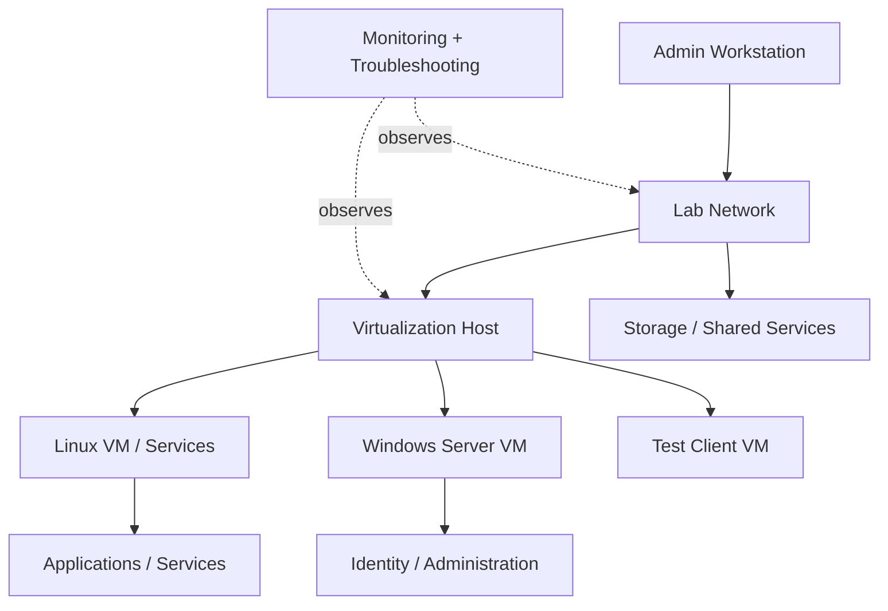

<div align="center">

# Infrastructure Home Lab

### Linux · Windows Server · Networking · Virtualization · Storage

A hands-on infrastructure lab used to practice system administration, networking, virtualization, troubleshooting, and service deployment outside of production environments.


</div>

---

## Why I built this lab

I use this environment to move beyond tutorials and work directly with infrastructure concepts in a controlled setting.

The lab gives me a place to practice:

- Linux and Windows administration
- virtual machines and isolated test environments
- TCP/IP, DNS, DHCP, routing, and network troubleshooting
- server roles and infrastructure services
- storage and backup concepts
- system monitoring and troubleshooting
- access control and user administration
- documenting changes and recovery steps

The goal is simple: **build, break, troubleshoot, rebuild, and understand why the system behaves the way it does.**

---

## High-level lab architecture



This diagram is intentionally high-level. Exact hardware, addresses, credentials, and private network details are not published.

---

## Skills demonstrated

| Area | What I practice |
|---|---|
| **Linux** | Server administration, services, permissions, packages, logs, troubleshooting |
| **Windows Server** | Server roles, administration, users, policies, and infrastructure services |
| **Networking** | TCP/IP, DNS, DHCP, connectivity, segmentation concepts, troubleshooting |
| **Virtualization** | Creating and managing isolated server/client environments |
| **Storage** | Shared storage, backup concepts, permissions, and recovery testing |
| **Operations** | Monitoring, incident-style troubleshooting, documentation, and rebuilds |

---

## What this repository contains

```text
infrastructure-home-lab/
├── README.md
├── docs/
│   ├── architecture.md
│   ├── lab-notes.md
│   └── troubleshooting.md
├── diagrams/
│   └── README.md
├── configs/
│   └── README.md
└── screenshots/
    └── README.md
```

Only safe, non-sensitive material is published here. Passwords, private IP details, keys, secrets, and anything that could expose a real environment are excluded.

---

## Current focus

The lab is being developed as a practical environment for infrastructure and cloud/DevOps fundamentals rather than as a collection of disconnected tutorials.

Current areas of focus:

- server administration
- network troubleshooting
- virtualization
- infrastructure services
- documentation and repeatable setup
- operational thinking

Future additions may include automation, monitoring, container workloads, and cloud-connected lab scenarios where useful.

---

## Lab roadmap

- [x] Create infrastructure portfolio repository
- [x] Document the high-level architecture
- [ ] Add real screenshots from the environment
- [ ] Add a verified inventory of systems and services
- [ ] Document one Linux server build
- [ ] Document one Windows Server build
- [ ] Add a troubleshooting case study
- [ ] Add a network diagram based on the real lab
- [ ] Add automation/configuration examples
- [ ] Add monitoring and backup documentation

---

## Portfolio purpose

This repository is designed to show how I approach infrastructure work: not just installing software, but understanding **systems, dependencies, failure points, and operations**.

As the lab evolves, I will add selected evidence from real configurations and troubleshooting work while keeping sensitive environment details private.

---

<div align="center">

### Build → Break → Troubleshoot → Rebuild → Document

<sub>Practical infrastructure learning through hands-on systems work.</sub>

</div>
