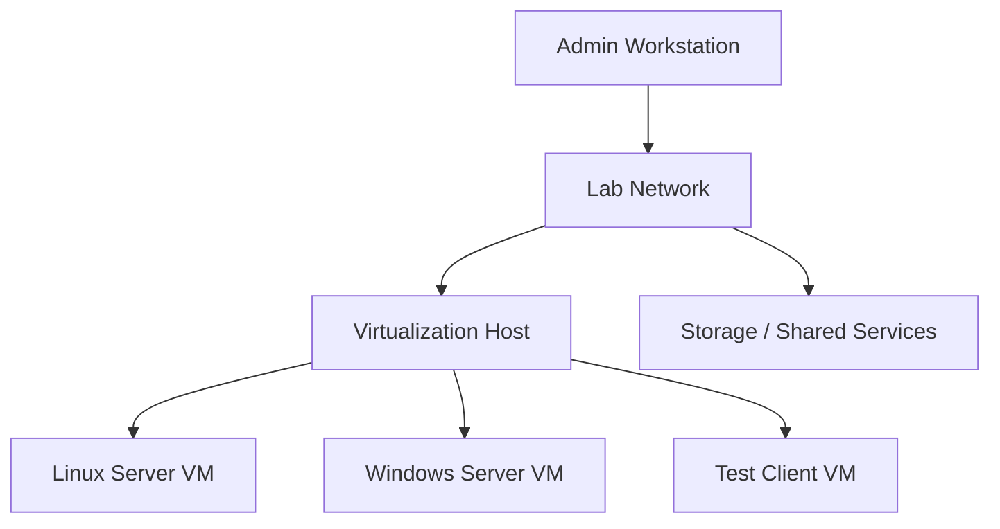

# Architecture

This document describes the lab at a safe, high level.

## Core layout

The environment is organized around a virtualization host and isolated virtual machines used for server, client, networking, and administration practice.

## Design goals

- keep experiments isolated from production systems
- make services easy to rebuild
- practice infrastructure troubleshooting safely
- document what changes and why
- avoid publishing sensitive network or credential information

Exact addressing, credentials, hardware identifiers, and private configuration values are intentionally omitted from this public repository.
